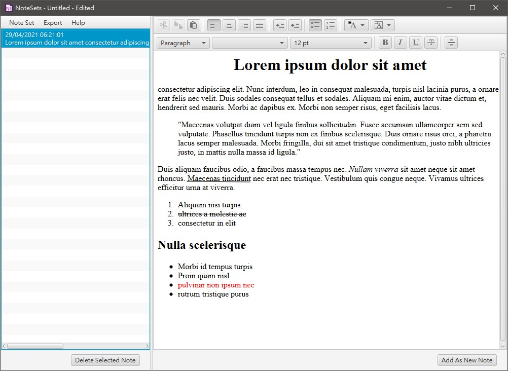

# NoteSets


Simple note-taking desktop application that allows text formatting, grouping of
notes into different note sets, saving and loading note sets, and the exporting
of notes as .html files.

It is submitted as my [CS50x 2021](https://cs50.harvard.edu/x/2021/) Final
Project.

## Screenshot


## Video Demo
[Link to a video demo](https://youtu.be/rRDLMgRwgM4) that demonstrates
some of NoteSets' features.

## Technologies
- Java 11+
- JavaFX / OpenJFX 11+
- Jsoup
- Jpackage

## Launch
### 1. Launching from source files
Java and JavaFX runtime required on your local machine. Run app.MainApp. You'll
need to add the below vm-args when running the project

```
--module-path %PATH_TO_FX% --add-modules
javafx.controls,javafx.fxml,javafx.web
```

### 2. Launching from Jar file
Java and JavaFX runtime required on your local machine. Download
`release\jar\NoteSets.jar` and run it from command line with

```
$ java --module-path %PATH_TO_FX% --add-modules
javafx.controls,javafx.fxml,javafx.web -jar --enable-preview NoteSets.jar
```

## Features
- Group or categorize notes together by creating different note sets.
- Text formatting available (e.g. Bold, italics, indentation, lists, color).
- Save note set as `.noteset` files
- Load existing `.noteset` files
- Export selected notes as `.html` files for portability or web uses.
- Export the whole note set as a `.zip` file consisting of all the notes as
  `.html` files.
- Reminder to save file before creating new empty note set, loading another set,
  or closing the application, to prevent data loss.
- Application title bar is also a status bar, providing quick reference to the
  current status of the current note set.

## Tutorial
[This NoteSets tutorial](src/app/resources/tutorial.html) introduces NoteSets'
various feature and their uses.

This very same tutorial is also embedded in
NoteSets itself, simply select `Tutorial` from the `Help` menu when NoteSets is
running.

## FAQ
### Can I use NoteSets as an WYSIWYG html editor?
NoteSets use JavaFX's built in HTMLEditor component as a text editor, so in
theory you can use NoteSets to build websites. But it is not the recommended use
of NoteSets, since the HTMLEditor is too barebone for web development, you can't
even create hyperlinks with it, for example.
